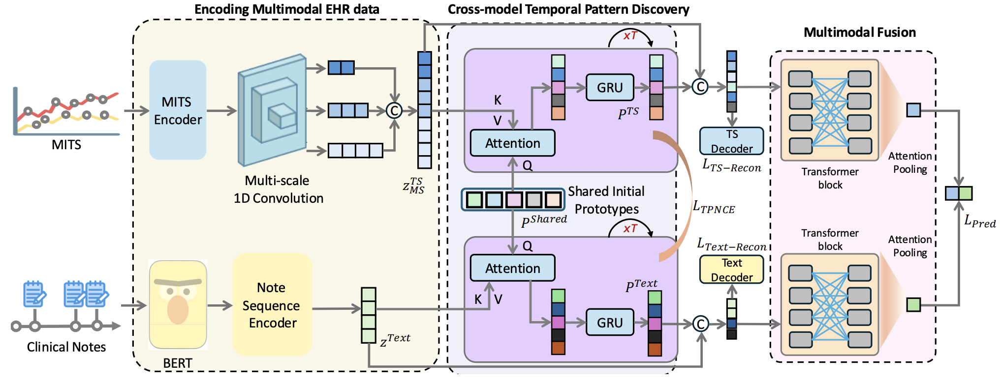

# CTPD

<b>CTPD: Cross-Modal Temporal Pattern Discovery for Enhanced Multimodal Electronic Health Records Analysis</b>, ACL 2025 Findings.
<br><em>Fuying Wang*, Feng Wu*, Yihan Tang, Lequan Yu</em></br>

[Arxiv](https://arxiv.org/abs/2411.00696) | [Cite](#acknowledgements)

**Abstract**: Integrating multimodal Electronic Health Records (EHR) data, such as numerical time series and free-text clinical reports, has great potential in predicting clinical outcomes. However, prior work has primarily focused on capturing temporal interactions within individual samples and fusing multimodal information, overlooking critical temporal patterns across patients. These patterns, such as trends in vital signs like abnormal heart rate or blood pressure, can indicate deteriorating health or an impending critical event. Similarly, clinical notes often contain textual descriptions that reflect these patterns. Identifying corresponding temporal patterns across different modalities is crucial for improving the accuracy of clinical outcome predictions, yet it remains a challenging task. To address this gap, we introduce a Cross-Modal Temporal Pattern Discovery (CTPD) framework, designed to efficiently extract meaningful cross-modal temporal patterns from multimodal EHR data. Our approach introduces shared initial temporal pattern representations which are refined using slot attention to generate temporal semantic embeddings. To ensure rich cross-modal temporal semantics in the learned patterns, we introduce a contrastive-based TPNCE loss for cross-modal alignment, along with two reconstruction losses to retain core information of each modality. Evaluations on two clinically critical tasks, 48-hour in-hospital mortality and 24-hour phenotype classification, using the MIMIC-III database demonstrate the superiority of our method over existing approaches.



### Installation
```
conda install -c pytorch -c nvidia faiss-gpu=1.8.0
pip3 install torch torchvision torchaudio --index-url https://download.pytorch.org/whl/cu124
pip install -r requirements.txt
pip install -e .
```

### Dataset Preprocessing

1. Downdoad the original [MIMIC-III](https://physionet.org/content/mimiciii/1.4/) database into your disk. 

2. Run the preprocessing code in `src/cmehr/preprocess/mimic3/run_mimic3_benchmark.sh`

Detailed steps: 

a. Run the command `cd src/cmehr/preprocess`.

b. The following command takes MIMIC-III CSVs, generates one directory per SUBJECT_ID and writes ICU stay information to data/{SUBJECT_ID}/stays.csv, diagnoses to data/{SUBJECT_ID}/diagnoses.csv, and events to data/{SUBJECT_ID}/events.csv. This step might take around an hour.
Here `data/root/` denotes the folder to store the processed benchmark data.

```
python -m mimic3benchmark.scripts.extract_subjects {PATH TO MIMIC-III CSVs} data/root/
```

c. The following command attempts to fix some issues (ICU stay ID is missing) and removes the events that have missing information. About 80% of events remain after removing all suspicious rows.
```
python -m mimic3benchmark.scripts.validate_events data/root/
```

d. The next command breaks up per-subject data into separate episodes (pertaining to ICU stays). Time series of events are stored in {SUBJECT_ID}/episode{#}_timeseries.csv (where # counts distinct episodes) while episode-level information (patient age, gender, ethnicity, height, weight) and outcomes (mortality, length of stay, diagnoses) are stores in {SUBJECT_ID}/episode{#}.csv. This script requires two files, one that maps event ITEMIDs to clinical variables and another that defines valid ranges for clinical variables (for detecting outliers, etc.). Outlier detection is disabled in the current version.

```
python -m mimic3benchmark.scripts.extract_episodes_from_subjects data/root/
```

e. The next command splits the whole dataset into training and testing sets. Note that the train/test split is the same of all tasks.

```
python -m mimic3benchmark.scripts.split_train_and_test data/root/
```

f. The following commands will generate task-specific datasets, which can later be used in models. These commands are independent, if you are going to work only on one benchmark task, you can run only the corresponding command.

```
python -m mimic3benchmark.scripts.create_in_hospital_mortality data/root/ data/in-hospital-mortality/
python -m mimic3benchmark.scripts.create_decompensation data/root/ data/decompensation/
python -m mimic3benchmark.scripts.create_length_of_stay data/root/ data/length-of-stay/
python -m mimic3benchmark.scripts.create_phenotyping data/root/ data/phenotyping/
python -m mimic3benchmark.scripts.create_multitask data/root/ data/multitask/
```

g. Use the following command to extract validation set from the training set. This step is required for running the baseline models. Likewise, the train/test split, the train/validation split is the same for all tasks.

```
python -m mimic3models.split_train_val {dataset-directory} --valset mimic3models/resources/valset_{task}.csv
```

h. Generate corresponding text files
```
cd src/cmehr/preprocess/ClinicalNotesICU/mimic3
# modify the dataset_path in Line 157 and output_folder in Line 161
python extract_notes.py
# modify the mimic_iii_benchmark_path in Line 6
python extract_T0.py
```

i. create pickle files to store multimodal data.
```
python -m mimic3models.create_iiregular_ts --task {TASK}
``` 

Example commands can be found in `src/cmehr/preprocess/mimic3/run_mimic3_benchmark.sh`.

At the end, you will have a folder `output_mimic3`, which contains the stored pickle files for each task.

We thank awesome open-source repositories [MIMIC-III Benchmark](https://github.com/YerevaNN/mimic3-benchmarks), [ClinicalNotesICU](https://github.com/kaggarwal/ClinicalNotesICU) and [MultimodalMIMIC](https://github.com/XZhang97666/MultimodalMIMIC) for their code.

### Usage

Please see the scripts in `scripts/mimic3`.

To run our approach:
```
cd scripts/mimimc3
sh train_ctpd_ihm.sh
sh train_ctpd_pheno.sh
```

To run baselines:
```
sh ts_baseines.sh
sh note_baselines.sh
```

Note that the code of baselines is from their official repository.


## Acknowledgements
If you find our work useful in your research or if you use parts of our code, please cite our paper:

```
@article{wang2024ctpd,
  title={CTPD: Cross-Modal Temporal Pattern Discovery for Enhanced Multimodal Electronic Health Records Analysis},
  author={Wang, Fuying and Wu, Feng and Tang, Yihan and Yu, Lequan},
  journal={arXiv preprint arXiv:2411.00696},
  year={2024}
}
```
